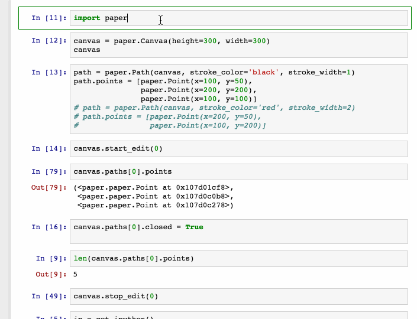

# ipython-papershape
paper.js based shape drawing widget

## install

`pip install .`

or for dev installs

`pip install -e .`

**If you have trouble using pip, try**

`python setup.py install`

## usage

see `examples/basic.ipynb` [nbviewer](https://github.com/jdfreder/ipython-papershape/blob/master/examples/basic.ipynb)
